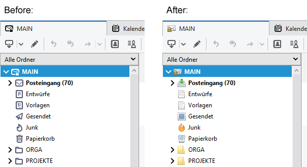

# Thunderbird-Classic-Icons
Classic account/folder icons for Thunderbird 78 and later

If you - like me - appreciate that Thunderbird now has OpenPGP integrated, but don't like those fuzzy monochrome SVG icons in the folder pane (and you don't need them because you don't use a HiDPI display), here how to restore the previous look:

* Create a folder called "chrome" in your Thunderbird profile folder.

* Copy "userChrome.css" and folder "classic" into this new chrome folder.

* In Thunderbird's advanced settings, set toolkit.legacyUserProfileCustomizations.stylesheets to true.

* Restart Thunderbird.

